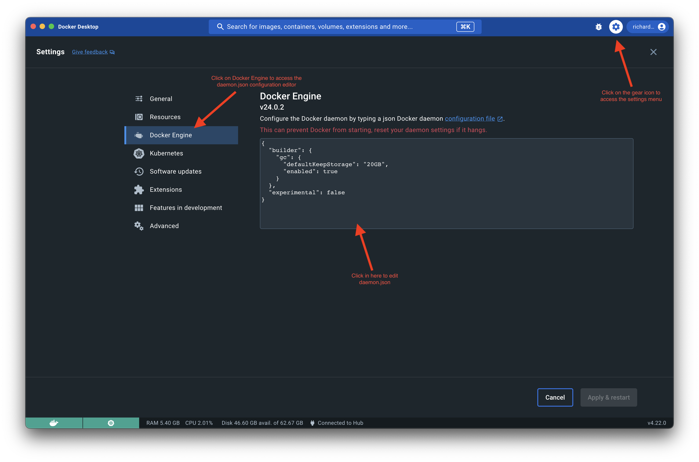
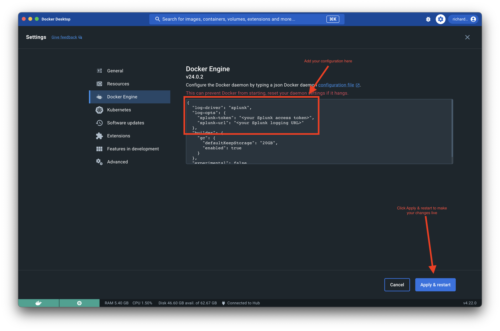

# splunk-logging-how-to
How-to configure Docker Desktop to Log to Splunk

Docker Desktop can be configured to log to Splunk as a one-off via the Docker Desktop UI or it may be configured for mass deployment by packaging it with a custom daemon.json. Each option will be detailed below, but the changes to daemon.json are equivalent for both options.

# Option 1: Configuration with Docker Desktop UI

1. Navigate to the Settings menu in Docker Desktop and click on Docker Engine




2. Obtain your Splunk access token and endpoint URL

3. Paste the following JSON into the editor and change the token and url properties to match your own.

4. Click `Apply & restart` and your logging configuration should be live
```
"log-driver": "splunk",
  "log-opts": {
    "splunk-token": "<your Splunk access token>",
    "splunk-url": "<your Splunk logging URL>"
  },
```


# Option 2: Configuration by distributing a custom daemon.json

1. Start with your existing daemon.json configuration. If you don't currently have a default you can start with the snippet below and customize it to your liking based on the available configuration options listed [here](https://docs.docker.com/config/daemon/).

```
{
  "builder": {
    "gc": {
      "defaultKeepStorage": "20GB",
      "enabled": true
    }
  },
  "experimental": false
}
```

2. Place the following snippet above the "builder" block in your daemon.json file and edit it to have your Splunk access token and Splunk endpoint URL.
```
"log-driver": "splunk",
  "log-opts": {
    "splunk-token": "<your Splunk access token>",
    "splunk-url": "<your Splunk logging URL>"
  },
```

3. Your daemon.json file should now look something like the following
```
{
"log-driver": "splunk",
  "log-opts": {
    "splunk-token": "<your Splunk access token>",
    "splunk-url": "<your Splunk logging URL>"
  },
  "builder": {
    "gc": {
      "defaultKeepStorage": "20GB",
      "enabled": true
    }
  },
  "experimental": false
}
```

4. Use the tooling of your choice to distribute the daemon.json file to each machine and restart Docker Desktop and/or the Docker Engine daemon.

    4a. On Windows ensure daemon.json is placed here: `%programdata%\docker\config\daemon.json`

    4b. On macOS ensure daemon.json is placed here: `$HOME/.docker/daemon.json`